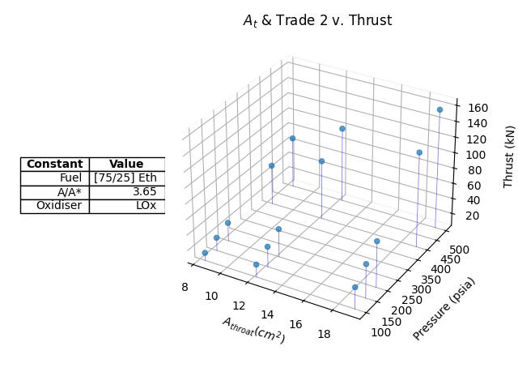
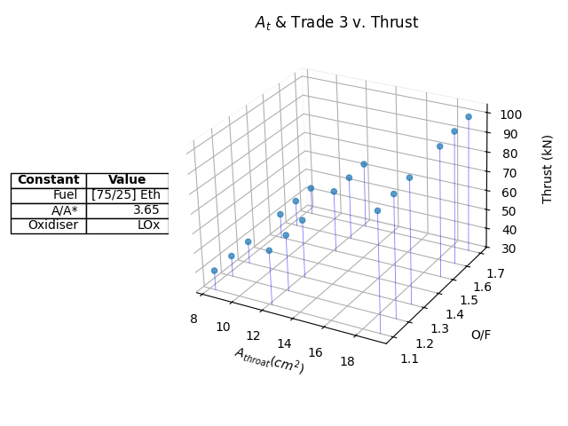
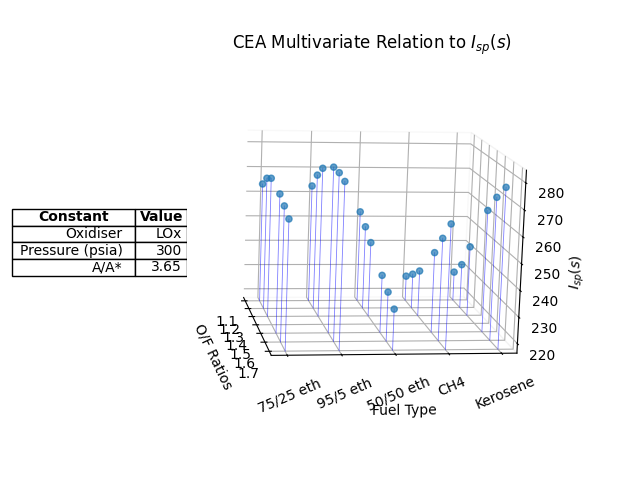
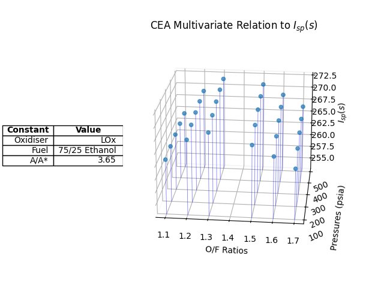
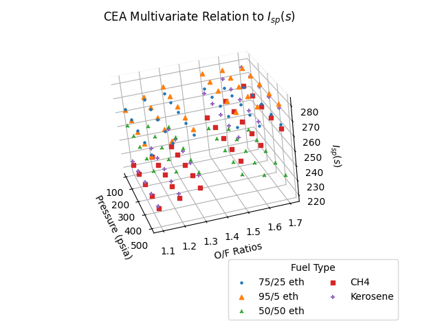
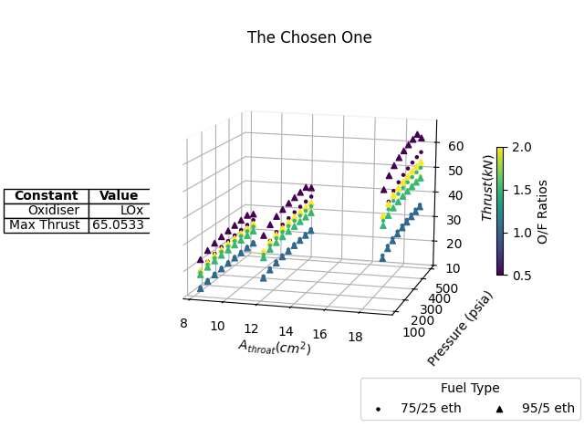

# Rocket Project NASA CEA Deliverable - Aaron Li

This is the writeup markdown file by Aaron Li describing how I executed the project deliverable and the use of
the files in this CEA Parser directory, leaving as much detail as possible

If you cannot render this on your machine (VSCode), open this repository in https://github.com/TinFoiKa/CEA-Parser

### Deliverables Executed

- [Task 1 - Fuel v. Performance](#task-1-fuel-type-vs-performance-parameters-ceapy)
- [Task 2 - Pressure v. Performance](#task-2-chamber-pressure-v-performance-parameters)
- [Task 3 - O/F v. Performance](#task-3-of-ratio-v-performance-parameters)
- [Bonus 1 - Thrust Calculation](#bonus-1-thrust-calculations)
- [Bonus 2 - Graphing w/ two IVs](#bonus-2-graphing-with-two-ivs)

## Graphics

Before I get into how I executed each individual task, you can see in parse.py that there is code that also generates the figures I use throughout this writeup.

To replicate on one's own machine, make sure you have matplotlib installed

```
pip install matplotlib numpy mplcursor
```

Note that the project also has numpy and mplcursor (for interactivity) dependencies

I use the pyplot library to generate ALL figures using a single main method in parse.py.

## Task 1: Fuel Type vs. Performance Parameters (cea.py)

The tedious way of solving this problem would be to use the CEA web app to run each fuel case individually with
one value only for each parameter. I decided that this was boring, and knew for a fact that there must be a python API
I could use to make this process go by faster 

(Note that I still use the web app and the text parser for other,
web-app accomodated tasks.) 

### Development

After a 5 minute parse of google results when I asked for CEA python APIs, I found a wrapper specifically for rocketCEA
called, very creatively, "rocketcea." (on PyPi)

For those testing this program on their own machine (note that the API is a numpy dependency, and I will assume you have Fortran support on Mac and MINGW *properly* installed if you are on windows. This should work on a **properly** set up machine.)

```
pip install rocketcea
```

Using this, I build cea.py with the documentation at https://rocketcea.readthedocs.io/en/latest/

This file specifically calls the CEA_Obj to iterate through an array of fuel types (and self-defined mixtures using the add_new_fuel() method) to output the 3 performance parameters in a tuple which is passed into parse.py through an import and function call dependency. Parse.py then generates the figures seen below:

### Results

GENERAL NOTE: I chose to show all 3 in bar graphs despite the potentially better representation as a line chart for especially chamber pressure and O/F ratios (due to the uncaught "jumps" in variables,) but please at least endure this section, because the [graphs get better](#bonus-2-graphing-with-two-ivs).

IVs: [75/25, 95/5, 50/50 Ethanol, Methane,  Kerosene]


In a discussion with another prospective member, we noticed that especially for fuels like Ethanol mixtures (self-defined in code using rocketcea frameworks,) both Ivac and Isp would return significantly different values to their cearun web app counterparts. For example 75/25 Ethanol would return $I_{vac}~2670 ms^{-1}$ on our self-run scripts and $~3000 ms^{-1}$ on the cearun web app. For kerosene (RP-1,) however, this difference would be more like $2496-2490$, which could totally be attributed to conversion errors or small differences in computation. This brings up the question: which would be more reliable? Is consistency, then, that we only stick to one system, the way to get around this evident inaccuracy?

### Discussion

Evidently, fuel type has a lot to do with the performance of the rocket. Just at a glance, 95/5 Ethanol outperforms other fuels in both specific impulse $I_{sp}$ and combustion performance (characteristic velocity) $c^*$ by a significant margin. 

Noting that effective exit velocity $c$ can be expressed as $c = c^{*}\cdot C_{f}$, the negligible improvements on $C_{f}$ in Kerosene and Methane versus the Ethanol-H<sub>2</sub>O mixtures mean very little to us in terms of effective performance. I'd be inclined to ignore the $C_f$ term in this use case.

Thus, between all 5 fuels, 95/5 Ethanol, being 95% Ethanol and 5% water, disregarding all real-world hazards and caveats, would give the rocket a higher exit velocity - whether this is desirable is out of scope of this question.

However, I can see why a less powerful fuel like 75/25 Ethanol could be preferred in some cases, understanding how optimal O/F ratios change as well as how the high specific heat capacity of water can balance the low heat capacity of ethanol in a regeneratively cooled system like the one on Ares. Indeed, the effectiveness does not decrease too significantly between the two mixtures according to the graph.

## Task 2: Chamber Pressure v. Performance Parameters

Directly using the web app to run through the different independent variables, I produce a CEA .txt file that I then run through the program in parse.py (all located at bottom of file)

### Results

IVs: [500, 400, 200, 150, 100] psia

File produced (and parsed): cea > pvP.txt


*I divide $9.809\,ms^{-2}$ from $I_{sp}$ here to adhere to the standard of keeping specific impulse in units of time

I would also prefer to see this data specifically as a line graph, however this also does work and gets the point across effectively anyways

### Discussion

Compared to the previous task, there's a much less significant gradient in how the independent variables modify our performance parameters. Still, it's obvious that as chamber pressure increases, so does the effectiveness of the rocket, using both metrics of characteristic velocity $c^*$ and specific impulse $I_{sp}$, with a surprisingly unchanging $C_f$ providing zero effect on the resulting effective velocity.

Of course, the greater the chamber is pressurised, the harder it is to design a pressure vessel capable of keeping itself together. However, I am noticing a small second-order decrease in both the $c^*$ and $I_{sp}$ graphs, suggesting that there may be a good tradeoff point around the 400 and 300 psia mark where the effectiveness of the rocket is not decreasing too much whilst maintaining that a pressure vessel capable of containing the gasses can be made.

If I had the time to extend this, I'd likely try to plot a more continuous graph using more data points between the same range [100-500] to see whether this second-order downwards concavity is captured in the produced figure.

## Task 3: O/F Ratio v. Performance Parameters

Once again, I directly use the web app and the same parse.py system.

### Results

IVs: [1.1, 1.2, 1.3, 1.5, 1.6, 1.7]

File produced (and parsed): cea > rvP.txt


### Discussion

This one certainly confused me the most, as I'd heard in the past that the optimal O/F ratio was supposed to be 1.6. However, according to the graph, as O/F decreases, both measures of $c^*$ and $I_{sp}$ increase, in this case producing the highest measure at O/F = 1.1

Yet again, theoretical $C_f$ also seems to still have no effect on the effective performance, leaving me with the question of whether this test produced valid results; a quick look through the input section of rvP.txt shows no anomalies.

Still, I refuse to let my researcher's bias show besides in this seemingly trivial case. The graph still clearly shows that an O/F ratio of 1.1 for chamber pressure 300 psia and a 75/25 Ethanol-water propellant produces the best results out of the given range.

## Bonus 1: Thrust Calculations

Given: 95% efficiency on $c^*$ and $C_\tau$ (from now on replaces $C_f$) results in a total $0.95^2$ efficiency

Take function of Thrust $F$ over $c^*$ and $C_\tau$ as

$$
F = \dot{m} \cdot c^* \cdot C_\tau \cdot 0.95^2
$$ 

Notice mass flow rate for ideal compressible flows as given by the [GRC paper](https://www1.grc.nasa.gov/beginners-guide-to-aeronautics/mass-flow-rate-equations/) is:

$$
 \dot{m} = \frac{Ap_t}{\sqrt{T_t}} \sqrt{\frac{\gamma}{R}} \, M (1+\frac{\gamma-1}{2}M^2)^{-\frac{\gamma+1}{2(\gamma-1)}}
$$

I'd like to break this apart into more digestible chunks, and link all these convoluted terms to corresponding ones on the CEA output file (our program specifically looks for displacement from each `COMPOSITION DURING EXPANSION FROM INFINITE AREA COMBUSTOR` marker).

The GRC paper gives us the following definitions of the variables, which lets us, using a matching process between the CEA input and output files and the given expression, may help us simplify and define the parameters of the problem

| Variable | Definition         |
|:--------:| ------------------ |
| $A$      | Throat Area        |
| $p_t$    | Total Pressure     |
| $T_t$    | Total Temp         |
| $M$      | Mach No.           |
| $R$      | Gas Constant       |
| $\gamma$ | Specific Heat Ratio|

I'll link a more specific writeup of how I pulled apart the GRC paper [here](#bonus-1-grc-pullapart)

| Variable | Definition         | CEA Symbol    |
|:--------:| ------------------ |:-------------:|
| $p_t$    | Total Pressure     | P             |
| $T_t$    | Total Temp         | T             |
| $M$      | Mach No.           | MACH HUMBER = 1|
| $R$      | Gas Constant       | R             |
| $\gamma$ | Specific Heat Ratio| GAMMAs        |

Using this to simplify the expression before we put in python code, where the subscript $_t$ denotes throat:

$$
 \dot{m}_{t} = \frac{Ap_t}{\sqrt{T_t}} \sqrt{\frac{\gamma}{R}} \, (1+\frac{\gamma-1}{2})^{-\frac{\gamma+1}{2(\gamma-1)}}
$$

I consistently mention in my longer [pullapart](#bonus-1-grc-pullapart) this idea of 'displacements' from the marker `COMPOSITION DURING EXPANSION FROM INFINITE AREA COMBUSTOR`. thrust.py wraps the function in parse.py to modify the read function for the values we need on the .txt files, where the displacements are as follows:

| CEA Symbol    | Displacement  |
|:-------------:|:-------------:|
| P             |   14
| T             |   15
| R             |   10
| GAMMAs        |   26
| CF            |   34
| CSTAR         |   33

Modifying our methods to encapsulate these thrust parameters is quite easy. The new implementation is an override of the parse.py parser in in thrust.py.

### Implementation

The most basic python code (seen in thrust.py) is as follows

```[python]
import numpy as np

# Given in deliverable and converted to m^2
isq_msq = 0.00064516
areas = [1.3*isq_msq, 1.886*isq_msq, 2.96*isq_msq]

# Parse .txt for CEA symbols
(p, big_t, big_r, gamma) = parse_txt("output.txt")

for a_star in areas:
    # mdot calculation
    a = a_star*p/np.sqrt(big_t)
    b = np.sqrt(gamma/big_r)
    c = 1 + (gamma-1)/2
    d = - (gamma + 1)/(2*(gamma-1))
    mdot = a * b * (np.pow(c,d))
    
    # Calculate thrust, send to matplotlib to show 3 graphs for 3 area conditions
    {...}
```

Note that the thrust calc (with considerations of 95% efficency) is now

$$
F = \dot{m}_t \cdot c^* \cdot C_\tau \cdot 0.95^2
$$

### Results

For cases where $A_t :=[0.03302, 0.0479044, 0.075184]m^2$ 

And Trade 2 (Pressure):



A quick analysis reveals that the thrust peaks at a pressure of 500 psia and a throat area of ~$19cm^2$ at a value of ~$93.3 kN$

And Trade 3 (O/F ratio):



Thrust in this case peaks at the largest throat area of $19.096cm^2$ yet again, and with the largest O/F ratio of 1.7, however this time only reaching $58.8 kN$

Note: these graphs use the self-developed multivariate plotter planned in bonus 2 and implemented in multivar.py

## Bonus 2: Graphing with Two IVs

You'll notice that I used the implementation I created in this section in Bonus 1, too. But I've preserved (mostly) the section below as a journal for how I approached this implementation:

### The Assignment

It seems one of the more realistic use cases here would be an analysis on O/F ratios and fuel types (1), as it both gives me a practical challenge and sort of forces me to use the rocketcea library instead of the web app.

However I'll also take the advice of the deliverable pdf and also do an analysis on variables chamber pressure and O/F ratio (2), still using the rocketcea library for ease and because text parsing gets more complex (and I don't want to spend that time) at higher dimensions.

### Simplifying Performance

Encapsulating performance is easy - an extension on [Bonus 1](#bonus-1-thrust-calculations) shows us that thrust $F$ is a value that can be represented in terms of either $c^*$ and $C_\tau$ or $I_{sp}$ in the following equations (taken from the slides):

$$
F = I_{sp} \cdot \dot{m}g
$$
$$
F = \dot{m} \cdot c^* \cdot C_\tau
$$ 

Simple rearranging shows us that all 3 variables are present in the identity $I_{sp}\cdot g = c^* \cdot C_\tau$. taking, then, $I_{sp}$ (which fittingly represents fuel efficiency as the ratio of how much of the force imparted onto the exhaust is 'returned' to the rocket [think Newton's 3rd]) as the ultimate performance parameter, we can graph a 3-variable relationship taking only $I_{sp}$ as the DV. 

Only reading $I_{sp}$ from the data files created, multivar.py holds two methods that read this singualr DV as a third dimension to, individually, (1) and (2) as laid out in the introduction.

### The Question of Visualisation

As for visualisation, it's quite evident that the answer is to produce a 3D graph and optimise for the multivariate peak. This isn't difficult statistics, we can still rely on stupid geometric intuition to understand maximums given 3 variables. The utility of this visualisation is that you answer a square-profile optimisation question (meaning you'd have to run 3 independent simulations of 3 IVs otherwise) in just a single simulation, where the maxima are very visually shown to you.

### Produced graph

This is the graph using self-developed code to show $I_{sp}$ per fuel type and O/F Ratio.



This is the graph showing $I_{sp}$ over Chamber Pressure and O/F Ratio:



The utility of this is incredible. Just with this 2IV implementation (foreshadowing), it saves the headache of trying to compare a whole bunch of 2D graphs side by side, and, as a very clear heuristic, the few values we care for is the maximum. 

Hence, when we extend up to n IVs, no matter how cluttered the graph is, culling down to a capped value (ahem see my section that mirrors [why silksong took so long to develop](#extension-squared-z-value-filtering)) means we can see exactly what parameters we can accept that still meet our thrust requirements.

### Extension up to 5IV implementation (multivar.py)

I believe the question this approaches is to think of how to graphically represent n-dimensional IV-DV relationships.

Taking visualisation as an extension, still, on cartesian representations, we know that we can map the tuple of n variables, which I will denote with $x_n$, can be mapped to a visually representable idea. For $n=3$, this looks like

$$
<x_1, x_2, x_3>\, :=\, <width(x), \,height(y), \,depth(z)>
$$

Raising to $n=4$, hue is also something we recognise very naturally. Simply:

$$
<x_1, x_2, x_3, x_4>\, :=\, <width(x), \,height(y), \,depth(z), \,colour(red\rightarrow green)>
$$

For increasingly baroque values of $n$, keeping ourselves on this tuple structure, we can expand this, within reasonable bounds of recognisability, recognising where data can be categorical/discrete (denoted with $^d$ and continuous as $^c$) like in fuel types to be represented as shapes like a diamond or open/closed circle, and including a time dimension that can be scrolled or numerically analysed to optimise for 6 dimensions (Example below shows 4IV<sup>c</sup> + 1IV<sup>d</sup> + 1DV) 

$$
\begin{pmatrix}
x_1^c \\ x_2^c \\ x_3^c \\ x_4^c \\ x_5^d \\ x_6^{d/c} 
\end{pmatrix}
:=
\begin{pmatrix}
width(x) \\ height(y) \\ depth(z) \\ colour(heat) \\ shape([...]) \\ time(t)
\end{pmatrix}
$$

Returning to practicality, for 3 and above independent variable dimensions, it's easy to see how the most intelligible graph is that of a scatterplot with shapes and gradients, with the performance parameter DV placed on the z-axis to show a clear peak that has IV vector of, say, <x,y,heat,shape>. 

For a strictly 3 IV relation, the most intelligible assignment for any categorical variable would certainly be the shape characteristic, whilst a 3 continuous variable assignment may be served best with a heat map from red to green to blue.

For 2 IVs, a simple scatter plot is enough.

### The PoC (3IV)


This is an example of a 3 IV - 1 DV graph. In its current state, it's quite difficult to look at. 

### The Slightly Less/More Cursed Child (4IV)
Taking IVs (courtesy of Adam Kajganic): 
* Fuel [95/5 Eth, 75/25 Eth]
* OF [0.5-2] (0.25 interval)
* Chamber Pressure [100-500psi] (50 interval)
* $A_{throat}$ [1.3, 1.886, 2.96] in^2

And maximising for thrust, we get a graph that is most certainly suspicious.



If we ignore the mismatches, which might have to do with conversion, division, or just general parameter errors (frankly just lazy coding at this point), this form of visualisation gives us a very nice full picture. Given extensions like [Z-value filtering](#extension-squared-z-value-filtering), or general QoL/visualisation implementations, I argue that this is actually a decent visualisation.

### Drawbacks of this Visualisation

Adam did bring up a good point against this visualisation. Especially for a case like this, where only 2 fuel types are given, It seems that a more fitting visualisation would be two normalised graphs side-by-side. Indeed, it would look less cluttered and any small bugs in code would likely be easier to catch. Yes, I agree that for someone trying to observe every single datapoint, my organisation seems like a headache. 

Yet for n-IV cases where maybe no variables only have a few values given (which, as I can presume, is quite rare,) this visualisation might actually be more beneficial than multiple side-by-side graphs. 

It's questionable whether the axes are really the most important focus points in this context. While more points means more clutter locally, I presume that only certain bands of thrust/misc. DV values will be at focus for the person this is being presented to. In that case, one set of axes, with points that can be filtered and, for example, hovered over or directly returned as a list to find the exact tuples of inputs that had produced said band of values, means a very easy and interactive visualisation environment that I'd personally find more useful than a figure that may have more axes markings than points. 

### Extension Squared: Z-value Filtering

If I was given infinite time I would make this the perfect CEA visualiser. However I'd like to work on another deliverable now, and I think just saying where I can take this next is enough.

I said it while commenting on the [produced graph](#produced-graph): filtering out all points beyond a certain Z-value by the will of a slider placed on the side of the interactive pyplot would be the logical next step and frankly quite simple. 

You'll also notice I have a whole ton of TODOs riddled around my code that suggest a max function, amongst other things related to making the plot more interactive and refactoring the code to be more friendly to programmers other than myself. Some include a failed attempt at implementing a hover feature that displays the (n-1) dimensional coordinate of a point. I even wonder if it would be worth shifting to a framework other than pyplot for such features.

## Appendix

### Bonus 1 GRC pullapart

| Variable | Definition         |
|:--------:| ------------------ |
| $A$      | Area               | 
| $p_t$    | Total Pressure     |
| $T_t$    | Total Temp         |
| $M$      | Mach No.           |
| $R$      | Gas Constant       |
| $\gamma$ | Specific Heat Ratio|

I'll start with the cancellable stuff first, assuming that all data for our specific thrust use case must come from the **throat**, as this is where, according to GRC, $\dot{m}$ is at a maximum

$M$ corresponds with symbol MACH NUMBER, -2 lines displaced from our parser breakpoint `COMPOSITION DURING EXPANSION FROM INFINITE AREA COMBUSTOR`. However, as stated by the GRC paper, and corroborated on the CEA ouput, this is a constant $M=1$ at the throat. 

$A$ is total throat Area, which we are given on the deliverable sheet to be a range from $[1.3, 1.886, 2.96]in^2$, which I'll be converting to metric (preserving as many s.f.s as possible) as $[0.03302, 0.0479044, 0.075184]m^2$ 

$R$ is the gas constant of the products coming out of the nozzle, provided in a not-so-convenient location at the top, behind %FUEL. I may have a more complex string parse function to search and handle this value in particular

$\gamma$ corresponds to GAMMAs (throat), -4 displacement from breakpoint.

$p_t$ and $T_t$ are represented by P and T respectively, -16 and -15 respectively. Conveniently, CEA has this put in terms of metric units for us already.

Our final pullapart sheet looks like:

| Variable | Definition         | CEA Symbol    |
|:--------:| ------------------ |:-------------:|
| $p_t$    | Total Pressure     | P             |
| $T_t$    | Total Temp         | T             |
| $M$      | Mach No.           | MACH HUMBER = 1|
| $R$      | Gas Constant       | R             |
| $\gamma$ | Specific Heat Ratio| GAMMAs        |

### Graph Type Selector From Abstracted Rules (MISTAKE, but lowk idk I like what I did)

Establish:

In IVs
* 4 of any means **scatter plot** (continuity ignored)
* 3 discrete means **scatter plot** prioritising **shape** over colour
* 3 continuous means **heat map 3D curve**
* 2 continuous 1 discrete (xyc $\rightarrow$ ccd, cdc, dcc)
    * ccd $\rightarrow$ can still stay **heat map 3D curve**
    * cdc, dcc $\rightarrow$ has **colour gradient**, but **stacked line** graph
* 1 continous 2 discrete (xyc $\rightarrow$ cdd, ddc, dcd)
    * cdd, dcd $\rightarrow$ has **colour gradient**, but on **stacked line** graph
    * ddc $\rightarrow$ is a **scatter** with **colour gradient**
* 2 continuous means **3D curve**
* 1 continuous 1 discrete means **stacked line** graph
