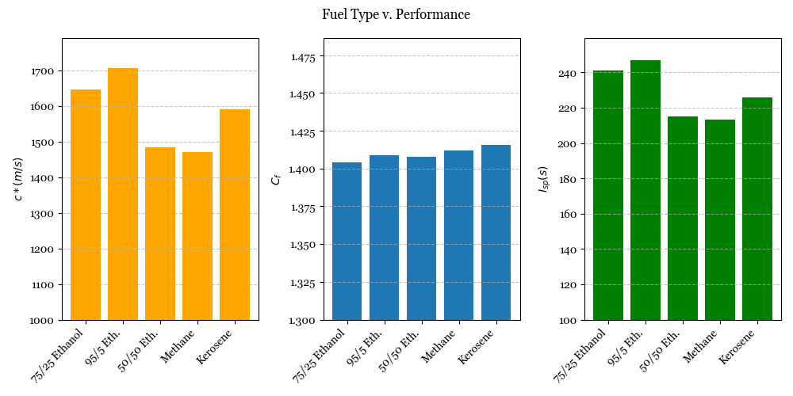
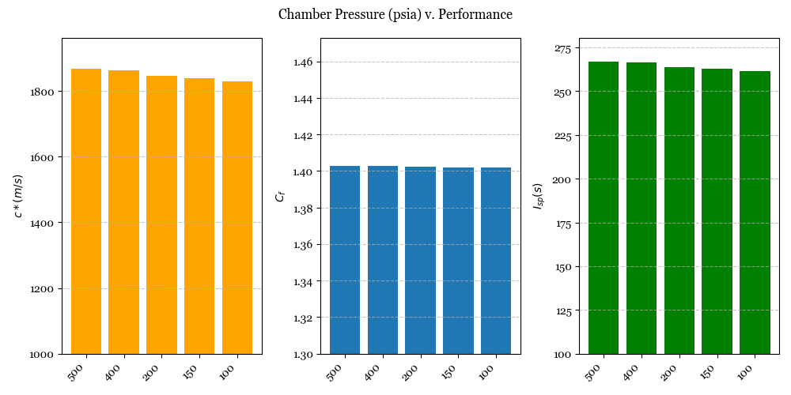
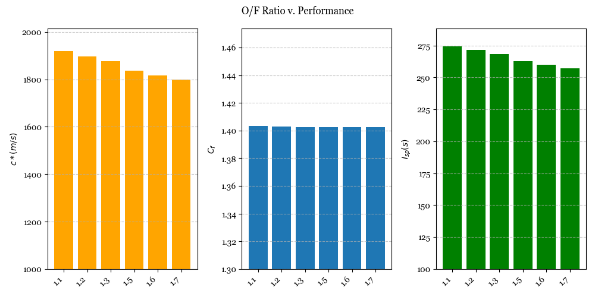

# Rocket Project NASA CEA Deliverable - Aaron Li

This is the writeup markdown file by Aaron Li describing how I executed the project deliverable and the use of
the files in this CEA Parser directory, leaving as much detail as possible

If you cannot render this on your machine (VSCode), open this repository in 

## Graphics

Before I get into how I executed each individual task, you can see in parse.py that there is code that also generates the figures I use throughout this writeup.

To replicate on one's own machine, make sure you have matplotlib installed

```
pip install matplotlib
```

I use the pyplot library to generate ALL figures using a single main method in parse.py.

## Task 1: Fuel Type vs. Performance Parameters (cea.py)

The tedious way of solving this problem would be to use the CEA web app to run each fuel case individually with
one value only for each parameter. I decided that this was boring, and knew for a fact that there must be a python API
I could use to make this process go by faster 

(Note that I still use the web app and the text parser for other,
web-app accomodated tasks.) 

### Development

After a 5 minute parse of google results when I asked for CEA python APIs, I found a wrapper specifically for rocketCEA
called, very creatively, "rocketcea." (on PyPi)

For those testing this program on their own machine (note that the API is a numpy dependency, and I will assume you have Fortran support on Mac and MINGW *properly* installed if you are on windows. This should work on a **properly** set up machine.)

```
pip install rocketcea numpy
```

Using this, I build cea.py with the documentation at https://rocketcea.readthedocs.io/en/latest/

This file specifically calls the CEA_Obj to iterate through an array of fuel types (and self-defined mixtures using the add_new_fuel() method) to output the 3 performance parameters in a tuple which is passed into parse.py through an import and function call dependency. Parse.py then generates the figures seen below:

### Results

IVs: [75/25, 95/5, 50/50 Ethanol, Methane,  Kerosene]



*I divide $9.809\,ms^{-2}$ from $I_{sp}$ here to adhere to the standard of keeping specific impulse in units of time

### Discussion

Evidently, fuel type has a lot to do with the performance of the rocket. Just at a glance, 95/5 Ethanol outperforms other fuels in both specific impulse $I_{sp}$ and combustion performance (characteristic velocity) $c^*$ by a significant margin. 

Noting that effective exit velocity $c$ can be expressed as $c = c^{*}\cdot C_{f}$, the negligible improvements on $C_{f}$ in Kerosene and Methane versus the Ethanol-H<sub>2</sub>O mixtures mean very little to us in terms of effective performance. I'd be inclined to ignore the $C_f$ term in this use case.

Thus, between all 5 fuels, 95/5 Ethanol, being 95% Ethanol and 5% water, disregarding all real-world hazards and caveats, would give the rocket a higher exit velocity - whether this is desirable is out of scope of this question.

However, I can see why a less powerful fuel like 75/25 Ethanol could be preferred in some cases, understanding how optimal O/F ratios change as well as how the high specific heat capacity of water can balance the low heat capacity of ethanol in a regeneratively cooled system like the one on Ares. Indeed, the effectiveness does not decrease too significantly between the two mixtures according to the graph.

## Task 2: Chamber Pressure v. Performance Parameters

Directly using the web app to run through the different independent variables, I produce a CEA .txt file that I then run through the program in parse.py (all located at bottom of file)

### Results

IVs: [500, 400, 200, 150, 100] psia

File produced (and parsed): cea > pvP.txt



I would also prefer to see this data specifically as a line graph, however this also does work and gets the point across effectively anyways

### Discussion

Compared to the previous task, there's a much less significant gradient in how the independent variables modify our performance parameters. Still, it's obvious that as chamber pressure increases, so does the effectiveness of the rocket, using both metrics of characteristic velocity $c^*$ and specific impulse $I_{sp}$, with a surprisingly unchanging $C_f$ providing zero effect on the resulting effective velocity.

Of course, the greater the chamber is pressurised, the harder it is to design a pressure vessel capable of keeping itself together. However, I am noticing a small second-order decrease in both the $c^*$ and $I_{sp}$ graphs, suggesting that there may be a good tradeoff point around the 400 and 300 psia mark where the effectiveness of the rocket is not decreasing too much whilst maintaining that a pressure vessel capable of containing the gasses can be made.

If I had the time to extend this, I'd likely try to plot a more continuous graph using more data points between the same range [100-500] to see whether this second-order downwards concavity is captured in the produced figure.

## Task 3: O/F Ratio v. Performance Parameters

Once again, I directly use the web app and the same parse.py system.

### Results

IVs: [1.1, 1.2, 1.3, 1.5, 1.6, 1.7]

File produced (and parsed): cea > rvP.txt



### Discussion

This one certainly confused me the most, as I'd heard in the past that the optimal O/F ratio was supposed to be 1.6. However, according to the graph, as O/F decreases, both measures of $c^*$ and $I_{sp}$ increase, in this case producing the highest measure at O/F = 1.1

Yet again, theoretical $C_f$ also seems to still have no effect on the effective performance, leaving me with the question of whether this test produced expected results - where a quick look through the input section of rvP.txt shows no anomalies.

Still, I refuse to let my researcher's bias show besides in this seemingly trivial case. The graph still clearly shows that an O/F ratio of 1.1 for chamber pressure 300 psia and a 75/25 Ethanol-water propellant produces the best results out of the given range.

## Bonus 1: Thrust Calculations

Given: 95% efficiency on $c^*$ and $C_\tau$ (from now on replaces $C_f$)

Take function of Thrust $F$ over $c^*$ and $C_\tau$ as

$$
F = \dot{m} \cdot c^* \cdot C_\tau
$$ 

Noticing mass flow rate for ideal compressible flows as given by the grc paper to be:

$$
 \dot{m} = \frac{Ap_t}{\sqrt{T_t}} \sqrt{\frac{\gamma}{R}} \, M (1+\frac{\gamma-1}{2}M^2)^{-\frac{\gamma+1}{2(\gamma-1)}}
$$

I'd like to break this apart into more digestible chunks, and link all these convuluted terms to the corresponding values given by the CEA


In order to do that, I will very brutishly expand our parse_txt method to search back from the PERFORMANCE PARAMETERS marker to search for 

## Bonus 2: Graphing Two IVs

It seems one of the more realistic use cases here would be an analysis on O/F ratios and fuel types, as it both gives me a practical challenge and sort of forces me to use the rocketcea library instead of the web app.

However I'll also take the advice of the deliverable pdf and also do an analysis on the .txt files provided by the NASA CEA web app on variables chamber pressure and O/F ratio (2 variable parser wrapper included in multivar.py as a modification on the implementation in parse.py)

### Simplifying Performance

Encapsulating performance is easy - [Bonus 1](#bonus-1-thrust-calculations) shows us that thrust $F$ is a value that can be represented in terms of either $c^*$ and $C_\tau$ or $I_{sp}$ in the following equations (taken from the slides):

$$
F = I_{sp} \cdot \dot{m}g
\newline \\[10pt]
F = \dot{m} \cdot c^* \cdot C_\tau
$$ 

Simple rearranging shows us that all 3 values are shown in $I_{sp}\cdot g = c^* \cdot C_\tau$. taking, then, $I_{sp}$ as the ultimate simple performance parameter, we can graph a 3-variable relationship taking only $I_{sp}$ as DV. 

### The Question of Visualisation

As for visualisation, it's quite evident that the answer is to produce a 3D graph and optimise for the multivariate peak. This isn't difficult statistics, we can still rely on stupid geometric intuition to understand maximums given 3 variables. 

### Produced graph

WE love matplotlib. Yes, WE. This would be very difficult otherwise, here this was frankly trivial and the implementation is also in multivar.py because I have no other ideas for file names.

This is the graph using the API and self-developed code to change fuel type and O/F Ratio.


This is the graph using the CEA web app modifying Chamber Pressure and O/F Ratio v. effective velocity ():


### Extension

I believe the question this approaches is to think of how to graphically represent n-dimensional CEA applications, which led me down a very... cartesian breakdown where I tried to apply methodological doubt to my inclination towards simple cartesian representations. 
